# Offical Elastic Community - Earthquake Watch App

## S2E1 - (Project planning)[https://ela.st/mbcc-season2-blog-1]
We are goinging to build a fullstack web app with Node.js and React. Then we will connect the server to Elastic Cloud. 
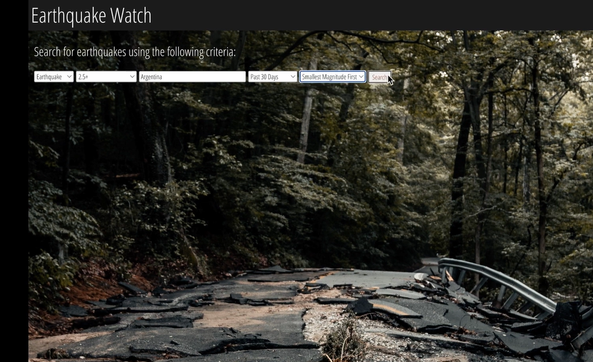
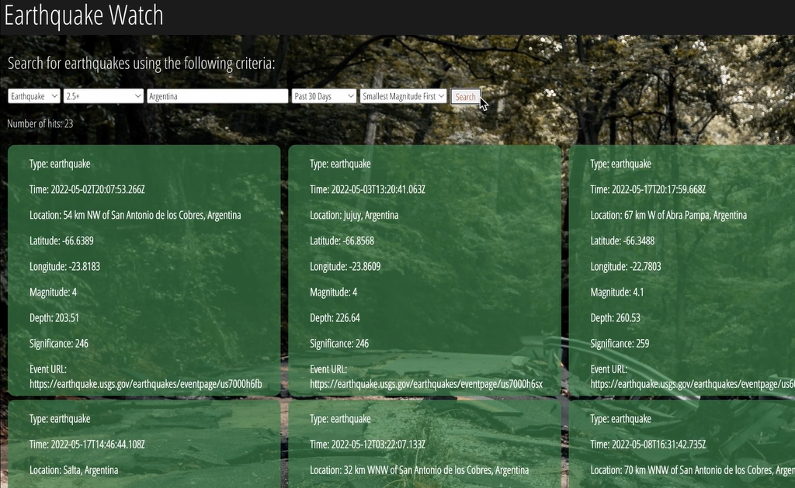

Next we will ingest global earthquake data into Elasticsearch, we will be getting this data from the USGS API.
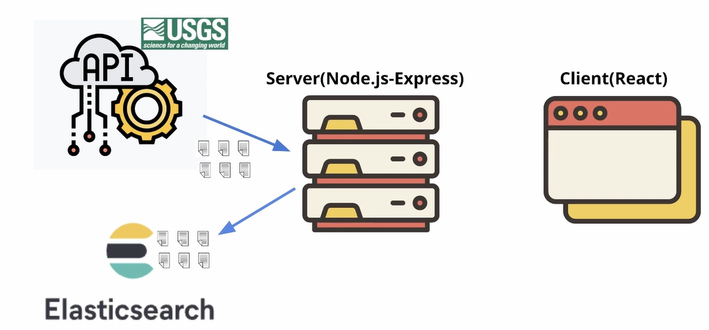
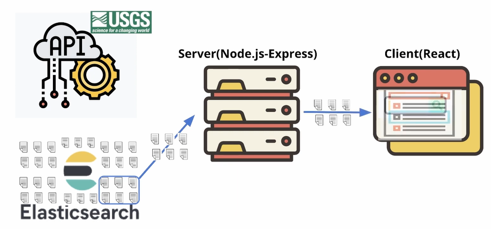

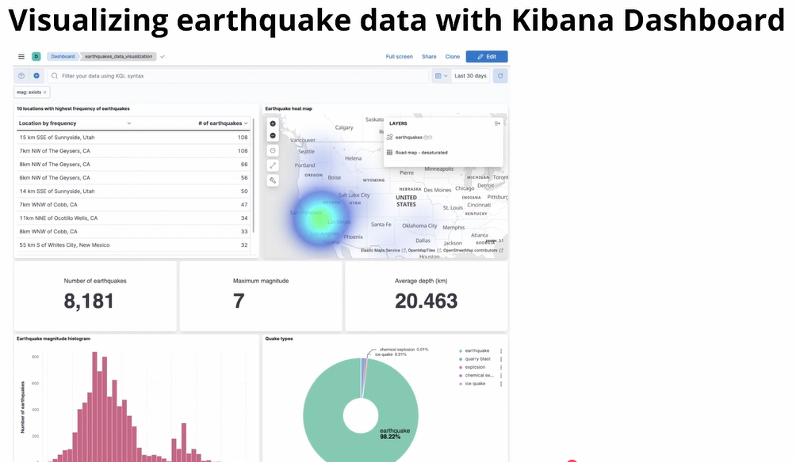


## S2E2 - (Building Server using Node.js with Express)[https://ela.st/mbcc-season2-blog-2]
### Create project on local and run it
- On terminal
``` 
mkdir earthquake_app
cd earthquake_app
npm init -y
npm install @elastic/elasticsearch axios config cors express log-timestamp nodemon
code .
```
- In the project folder, add a folder **server** and inside the folder add a file **server.js**. Write the following code inside:

```javascript
const express = require('express');

const app = express();
const PORT = 3001;

app.get('/', (req, res) => {
  res.send('Earthquake app server running');
});

app.listen(PORT, () => {
  console.log(`Server running on port http://localhost:${PORT}`);
});
```
 - In the package.json replace **index.js** with **server.js**. Server.js will be our app entry point. Also add this line under the **"Script"** section to run the app automaticly by nodemon when we do any change: 
 ```"start": "nodemon server/server.js"```

## Add your project to Github
In the project directory add a file **.gitignore**
Write inside
```javascript
# Node modules
node_modules/

# Logs
logs/
*.log
npm-debug.log*

# Environment variables
.env

# OS files
.DS_Store
Thumbs.db

# IDE/editor files
.vscode/
.idea/

# Optional: build/output folders
dist/
build/
```

- On the terminal:
```javascript
npm init
git add .
git commit -m 'Initial commit'
git remote add origin https://github.com/username/repository.git
git push -u origin master
```

## S2E3 - (Create an Elastic Cloud deployment)[https://ela.st/mbcc-season2-blog-3]
- Select a distribution model for your unique needs: Self-managed / Elastic Cloud / Elastic Cloud Enterprice / Elastic Cloud on Kubernetes.
We will use **Elastic Cloud**. 

### Create Elastic Cloud account
Try (Free 30 day trial)[https://cloud.elastic.co/registration?pg=global&plcmt=nav&cta=205352-primary]
(API Doc)[https://www.elastic.co/docs/api/doc/elasticsearch/operation/operation-license-post-start-trial]

Click on (**Create hosted deployment**)[https://cloud.elastic.co/home] => Choose Elasticsearch => Give a name of your choice to your deployment like Earthquake-App-Deployment => Click on Create hosted deployment.
Save the deployment credentials username and password somewhere immediately, as they will disappear. 
Your deployment is ready after that! The page will direct you to a page that you can create your first index.

## S2E4 - (Connect securely the Node.js server to Elastic Cloud)[https://ela.st/mbcc-season2-blog-4]
### Authentication types
There are 2 ways to connect to the Elastic Cloud
 - Basic authentication (logging in as a user)
 - API key => Best practice for production

To use API key, log into Elastic Cloud as a user first by basic authentication. 
In the repo, create **config** directory to store Elastic Cloud credentials => **default.json** and **custom-environment-variables.json**files.
Add the following for the basic authentication:

default.js
```javascript
{
	"elastic": {
		"cloudID": "", //this can be found under deployment list-> your deployment 'Cloud ID'
		"username": "",
		"password": ""
	}
}
```

custom-environment-variables.json
```javascript
{
  "elastic": {
    "cloudID": "ELASTIC_ID",
    "username": "ELASTIC_USERNAME",
    "password": "ELASTIC_PASSWORD"
  }
}
```

Create ELASTIC_ID, ELASTIC_USERNAME, ELASTIC_PASSWORD in .env file with actual credentails.


### Connect server to communicate with Elastic Cloud securely with Elastic Search client

Go to (Javascript client)[https://www.elastic.co/docs/reference/elasticsearch/clients/javascript] as we are using Node.js. This will allow your app to communicate with Elastic search cluster.

- Create a new instance of Elastic search client. This client will contain our elasticclub access credentials that points to our ES cluster. Then we will setup our server to connect to Elastic cloud and display a message in the terminal of its connection status. To do so in the **server** directory create a new directory named **elasticsearch** => **client.js** file. In the file write the following:

```javascript
const {Client} = require('@elastic/elasticsearch');
config = require('config');
const elasticConfig = config.get('elastic');	

const client = new Client({
	cloud: {
		id: elasticConfig.cloudID
	},
	auth: {
		username: elasticConfig.username,
		password: elasticConfig.password
	},
});

client.ping()
.then(() => console.log('You are connected to Elasticsearch!'))
.catch(console.error('Elasticesearch is not connected'));

module.exports = client;
```
- Add the following line into the server.js, where we create cluster.

```javascript
const client = require('./elasticsearch/client');
```
Finally the server is running fine and 'Elasticsearcj is connected'!

### Create API key
In the server directory create file **create-api-key.js** and write the following code inside.

```javascript
//in server/create-api-key.js
const client = require('./elasticsearch/client');

async function generateApiKeys(opts) {
  const body = await client.security.createApiKey({
    body: {
      name: 'earthquake_app',
      role_descriptors: {
        earthquakes_example_writer: {
          cluster: ['monitor'],
          index: [
            {
              names: ['earthquakes'],
              privileges: ['create_index', 'write', 'read', 'manage'],
            },
          ],
        },
      },
    },
  });
  return Buffer.from(`${body.id}:${body.api_key}`).toString('base64');
}

generateApiKeys()
  .then(console.log)
  .catch((err) => {
    console.error(err);
    process.exit(1);
  });
```
- in the project directory on the terminal run this code
```javascript
node server/create-api-key.js
```
copy the key it provides and add it to .env file as ELASTIC_API_KEY=api-key

In the default.json => add one more line ** "apiKey": "" **
In the custom-enviroment-variables.json  => add one more lin ** "apiKey": "ELASTIC_API_KEY"**
In the client.js => replace the following with new line;
```javascript
    username: elasticConfig.username,
    password: elasticConfig.password
```

with this
```javascript
 apiKey: elasticConfig.apiKey
 ```
Now our app is using API key to connect instead of basic auth.

## S2E5  - (Plan for effient data storage & search performance in Elasticsearch0[https://ela.st/mbcc-season2-blog-5]
### Assess the API data 

- Determine what data we need
- Discover if we need to transform the data to fit our use case
- Decide on the desired mapping for efficient storage and search of data

We will use the last 30 days of the earthquakes data so be sure to have this page pulled up as we are going over it. 

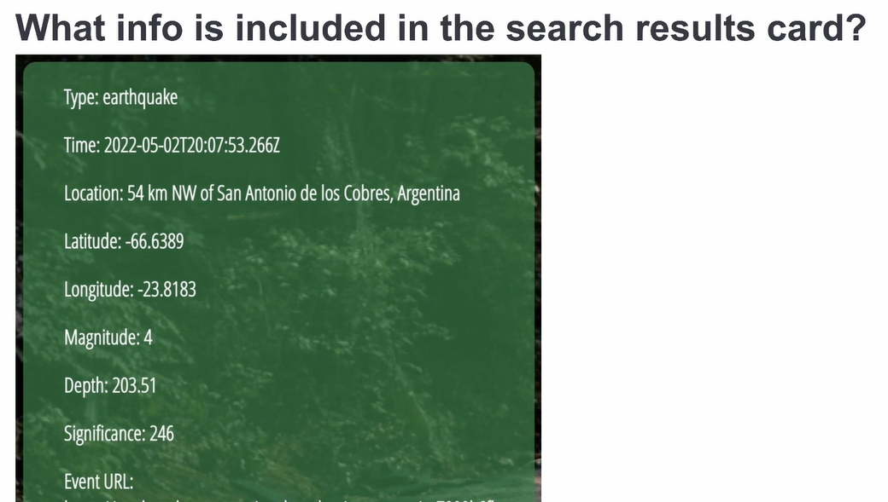
The information shown here is what we need from the USGS API. We will store this information on Elasticsearch in the form of documents. Each document will contain information about one earthquake.

**Examine the data struture of the earthquake API**
- (Earthquake Catalog Documentation)[https://earthquake.usgs.gov/data/comcat/index.php#nst]
- (USGS website - output data structure of the earthquake api )[https://earthquake.usgs.gov/earthquakes/feed/v1.0/geojson.php]
- (USGS Data of last 30 days)[https://earthquake.usgs.gov/earthquakes/feed/v1.0/summary/all_month.geojson]

Check USGS Output => Features
```javascript
 features: [
    {
      type: "Feature",
      properties: {
        mag: Decimal,
        place: String,
        time: Long Integer,
        updated: Long Integer,
        tz: Integer,
        url: String,
        detail: String,
        felt:Integer,
        cdi: Decimal,
        mmi: Decimal,
        alert: String,
        status: String,
        tsunami: Integer,
        sig:Integer,
        net: String,
        code: String,
        ids: String,
        sources: String,
        types: String,
        nst: Integer,
        dmin: Decimal,
        rms: Decimal,
        gap: Decimal,
        magType: String,
        type: String
      },
      geometry: {
        type: "Point",
        coordinates: [
          longitude,
          latitude,
          depth
        ]
      },
      id: String
    },
    …
  ]
```
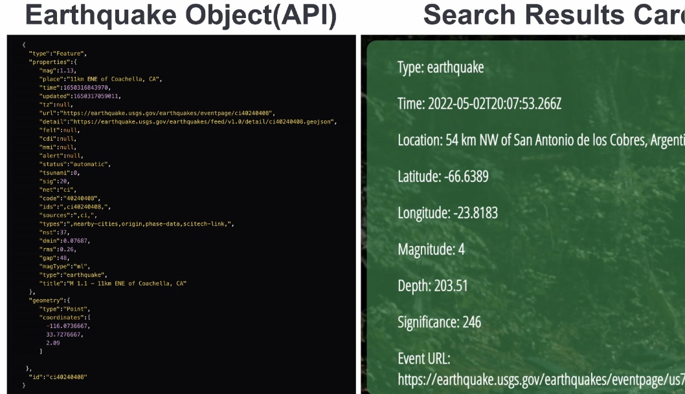

To save storage, we will only index the fields mag, place, time, url, sig(significance), type, and coordinates array which includes longitude, latitude, and depth in that order.

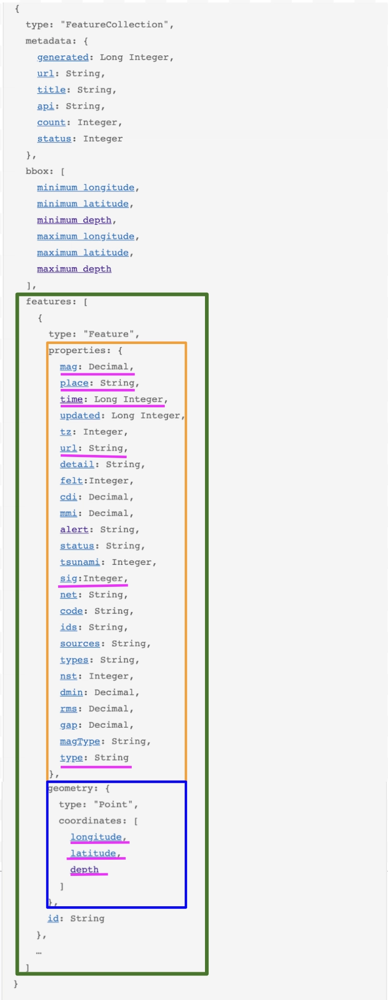

### How to store this data using the smallest disk space while maximizing our search performance
**Mapping** defines how a document and its fields are indexed and stored.
It does that by assigning types to fields being indexed. Depending on the assigned field type, each field is indexed and primed for different types of requests(full text search, exact searches, aggregations, sorting & etc).

Choose correct typed for each field
- (Elasticsearch Field data types)[https://www.elastic.co/docs/reference/elasticsearch/mapping-reference/field-data-types]
- (Elasticsearch Numeric field types)[https://www.elastic.co/docs/reference/elasticsearch/mapping-reference/number]
- (Elasticsearch Geopoint field type)[https://www.elastic.co/docs/reference/elasticsearch/mapping-reference/geo-point]

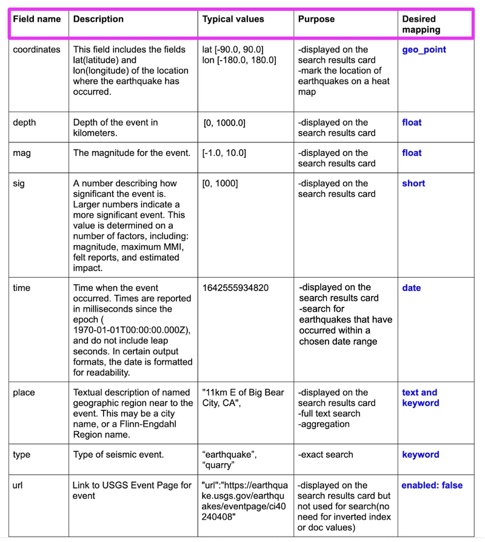

## S2E6  - (Setup Elasticsearch for data transformation and data ingestion)[https://ela.st/mbcc-season2-blog-6]
1. create an **ingest pipeline** to transform the retrieved data
2. create an index called **earthquakes** with the desired mapping

### Ingest Pipeline

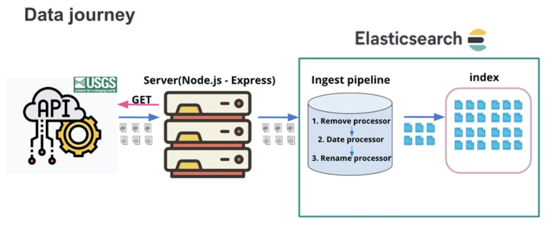

In the Kibana console, copy and paste the following:
```javascript
PUT earthquakes
{
  "mappings": {
    "properties": {
      "@timestamp": {
        "type": "date"
      },
      "coordinates": {
        "type": "geo_point"
      },
      "depth": {
        "type": "float"
      },
      "mag": {
        "type": "float"
      },
      "place": {
        "type": "text",
        "fields": {
          "keyword": {
            "type": "keyword"
          }
        }
      },
      "sig": {
        "type": "short"
      },
      "type": {
        "type": "keyword"
      },
      "url": {
        "enabled": false
      }
    }
  }
}
```
We will create it on Elastic Cloud page => Deployment => Stack Management => Ingest Pipelines => Create pipeline => New pipeline

Name your pipeline something like **earthquake_data_pipeline** .

**Step1: Review the data transformation requirements**
- remove unnecessary parts from data
- change the Unix epoch time to human readable timestap
- create a coordinates.lat and coordinates.log fields

- **add processors:**
 - remove the fields you dont need
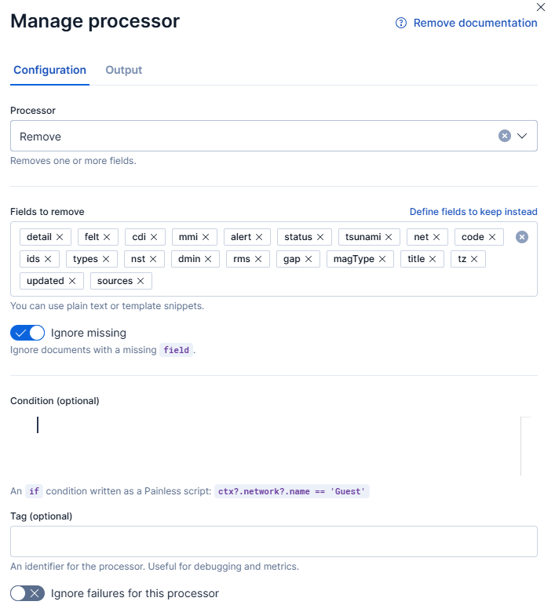
 - change time format
 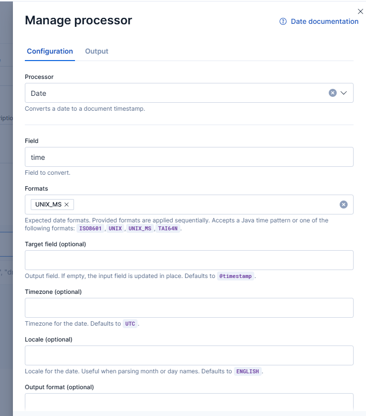
 - remove time 
  
 - add coordinates
 
 

We now have all the processors we need.

**Step2: Create an ingest pipeline**
There are 2 ways to create an ingest pipeline; Kibana Ingest pipeline feature or The Ingest API. 
We will use Kibana Ingest Pipeline.

Under the list of processors, click on the **Create pipeline** button. You will see the pipeline create.

**Step2: Create an Index**
Go to Kibana Dev tools and paste the desired mapping:

```javascript
PUT earthquakes
{
  "mappings": {
    "properties": {
      "@timestamp": {
        "type": "date"
      },
      "coordinates": {
        "type": "geo_point"
      },
      "depth": {
        "type": "float"
      },
      "mag": {
        "type": "float"
      },
      "place": {
        "type": "text",
        "fields": {
          "keyword": {
            "type": "keyword"
          }
        }
      },
      "sig": {
        "type": "short"
      },
      "type": {
        "type": "keyword"
      },
      "url": {
        "enabled": false
      }
    }
  }
}
```
On the right side you will get response of:

```javascript
{
  "acknowledged": true,
  "shards_acknowledged": true,
  "index": "earthquakes"
}
```
## S2E7  - (Set eu the Node.js server to retrieve API data and send the data to elasticsearch)[https://ela.st/mbcc-season2-blog-7]


We will set up the server to retrieve data from the USGS api and then sne dthe retrieved data to Elasticsearch Earthquake data pipeline.
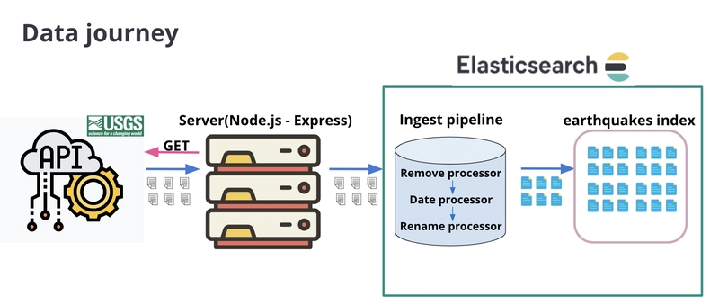


### Retrieve earthquake data from the USGS API
In the project repo, under server folder, create a folder called **data_management**. Inside this folder create file called **retrieve_and_ingest_data.js**.
This file will instruct the server to execute three things:
 - Upon receiving an http request retirieve earthquake data from the USGS API
 - Then send the retrieved data to ES Earthquake pipeline for data transformation
 - Then instruct ES to ingest transformed data into the earthquake index

Copy paste the following code into the etrieve_and_ingest_data.js file.
 ```javascript
 //in server/data_management/retrieve_and_ingest_data.js
const express = require('express');
const router = express.Router();
const axios = require('axios');
const client = require('../elasticsearch/client');
require('log-timestamp');

const URL = `https://earthquake.usgs.gov/earthquakes/feed/v1.0/summary/all_month.geojson`;

router.get('/earthquakes', async function (req, res) {
  console.log('Loading Application...');
  res.json('Running Application...');

  indexData = async () => {
    try {
      console.log('Retrieving data from the USGS API');

      const EARTHQUAKES = await axios.get(`${URL}`, {
        headers: {
          'Content-Type': ['application/json', 'charset=utf-8'],
        },
      });

      console.log('Data retrieved!');

      results = EARTHQUAKES.data.features;

      console.log('Indexing data...');

      results.map(
        async (results) => (
          (earthquakeObject = {
            place: results.properties.place,
            time: results.properties.time,
            tz: results.properties.tz,
            url: results.properties.url,
            detail: results.properties.detail,
            felt: results.properties.felt,
            cdi: results.properties.cdi,
            alert: results.properties.alert,
            status: results.properties.status,
            tsunami: results.properties.tsunami,
            sig: results.properties.sig,
            net: results.properties.net,
            code: results.properties.code,
            sources: results.properties.sources,
            nst: results.properties.nst,
            dmin: results.properties.dmin,
            rms: results.properties.rms,
            mag: results.properties.mag,
            magType: results.properties.magType,
            type: results.properties.type,
            longitude: results.geometry.coordinates[0],
            latitude: results.geometry.coordinates[1],
            depth: results.geometry.coordinates[2],
          }),
          await client.index({
            index: 'earthquakes',
            id: results.id,
            body: earthquakeObject,
            pipeline: 'earthquake_data_pipeline',
          })
        )
      );

      if (EARTHQUAKES.data.length) {
        indexData();
      } else {
        console.log('Data has been indexed successfully!');
      }
    } catch (err) {
      console.log(err);
    }

    console.log('Preparing for the next round of indexing...');
  };
  indexData();
});

module.exports = router;

```

We create a variable called results. This variable is set equal to the retrieved earthquake data from the API.

Remember the USGS API data structure covered in part 5?

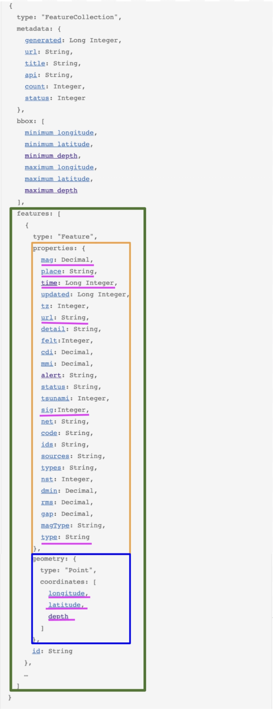
**EARTHQUAKES.data.features** gives you access to the features array(green box).
This array contains earthquake objects. Each object contains info about one earthquake.
Within each object, the fields **properties**(orange box) and **geometry**(blue box) contain the information that we want(**pink box**).

Next we will add the data ingestion route to **server.js**
```javascript
const data = require('./data_management/retrieve_and_ingest_data');

app.use('/ingest_data', data);
```

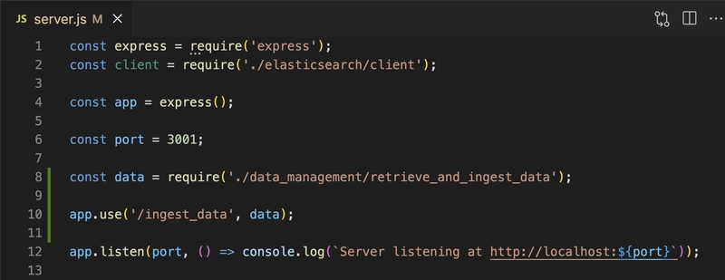

### Send the retrieved data to Elasticsearch earthquake_data_pipeline for data transformation
### Instruct Elasticsearch to ingest the transformed data into the earthquakes index

